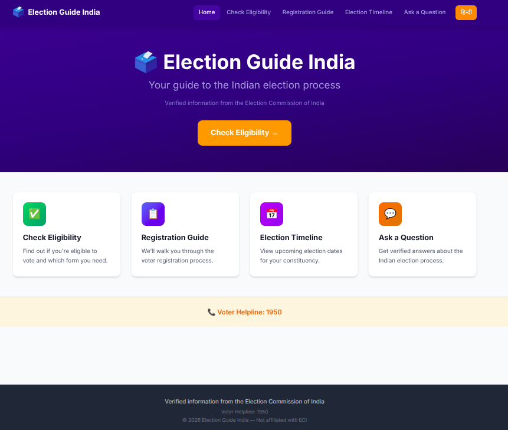
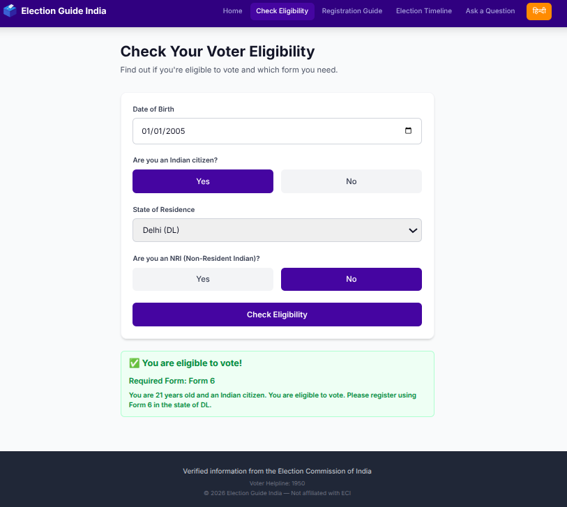
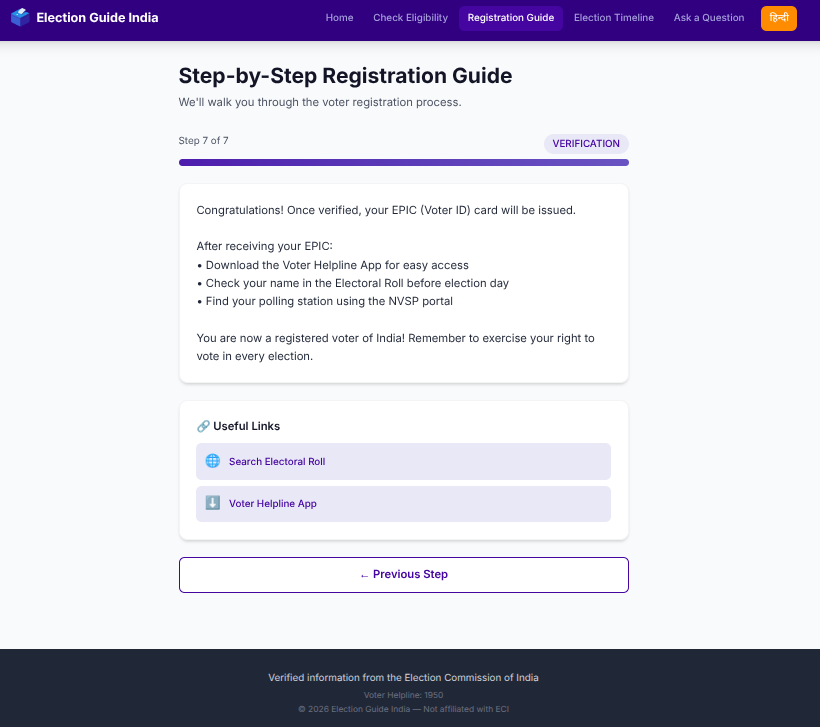
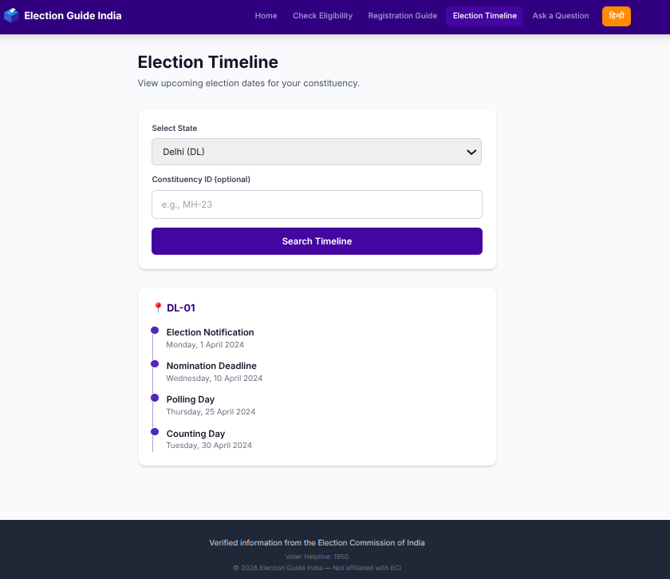
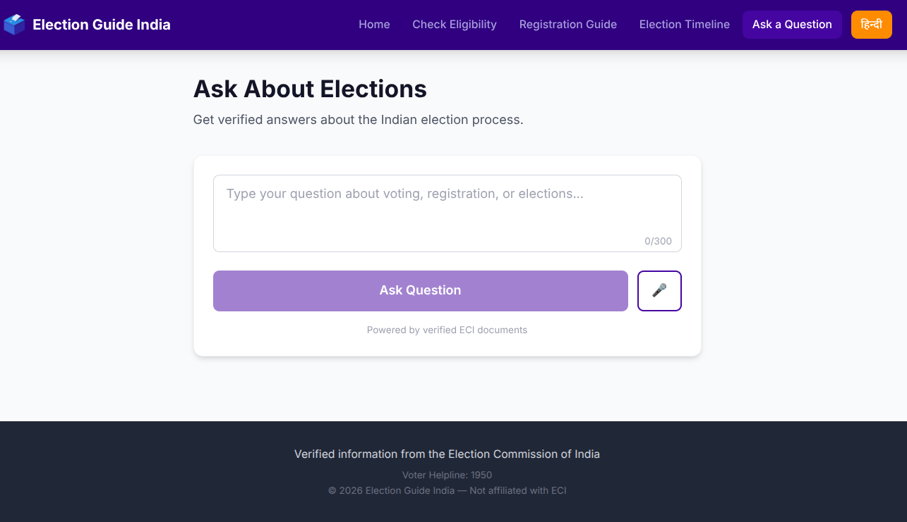

# Usage

This guide explains how to run and use the application locally.

## Run the Backend

Linux and macOS:

```bash
cd backend
source .venv/bin/activate
uvicorn main:app --host 0.0.0.0 --port 8080 --reload
```

Windows PowerShell:

```powershell
cd backend
.\.venv\Scripts\Activate.ps1
uvicorn main:app --host 0.0.0.0 --port 8080 --reload
```

Backend URLs:

| URL | Purpose |
| --- | --- |
| `http://localhost:8080/` | API root information. |
| `http://localhost:8080/health` | Health check. |
| `http://localhost:8080/docs` | Swagger UI. |
| `http://localhost:8080/redoc` | ReDoc API docs. |
| `http://localhost:8080/openapi.json` | OpenAPI JSON. |

Verify the backend:

```bash
curl http://localhost:8080/health
```

Expected response:

```json
{
  "status": "healthy",
  "environment": "development",
  "version": "1.0.0"
}
```

## Run the Frontend

Open a second terminal.

```bash
cd frontend
npm run dev
```

Open:

```text
http://localhost:5173
```

The Vite dev server proxies API requests from `/api` to `http://localhost:8080`.

## Build the Frontend

```bash
cd frontend
npm ci
npm run build
```

Preview the production build:

```bash
npm run preview
```

## Run Backend Tests

```bash
cd backend
python -m pytest tests/ -v
```

Run with coverage:

```bash
cd backend
python -m pytest tests/ -v --cov=. --cov-report=term-missing
```

## Application Pages

| Route | Page | What it does |
| --- | --- | --- |
| `/` | Home | Links to the main workflows. |
| `/eligibility` | Eligibility | Checks voter eligibility and required form. |
| `/guide` | Guide | Walks through voter registration steps. |
| `/timeline` | Timeline | Searches election events by state and optional constituency. |
| `/faq` | FAQ | Sends election-process questions to the backend FAQ assistant. |

## Screenshots

### Home Page



### Eligibility Workflow



### Registration Guide Workflow



### Timeline Workflow



### FAQ Workflow



## Example Workflow: Check Eligibility

1. Start the backend.
2. Start the frontend.
3. Open `http://localhost:5173/eligibility`.
4. Enter a date of birth.
5. Select citizenship status.
6. Select a state or union territory.
7. Select NRI status.
8. Click the eligibility check button.

The frontend sends:

```http
POST /api/v1/eligibility/evaluate
```

## Example Workflow: Registration Guide

1. Open `http://localhost:5173/guide`.
2. The page loads the `INIT` step.
3. Click the next button to move through the backend state machine.
4. Use the back button to return to previous states.

The frontend calls:

```http
GET /api/v1/guide/next-step?current_state=INIT
```

## Example Workflow: Timeline Search

1. Open `http://localhost:5173/timeline`.
2. Select a state code, such as `MH`.
3. Optionally enter a constituency ID, such as `MH-23`.
4. Submit the form.

The frontend calls:

```http
GET /api/v1/timeline?state_code=MH&constituency_id=MH-23
```

Timeline data must exist in Firestore before this workflow returns results.

## Example Workflow: FAQ

1. Open `http://localhost:5173/faq`.
2. Type a question with 3 to 300 characters.
3. Click the ask button.
4. Review the answer and citations.

The frontend calls:

```http
POST /api/v1/faq/ask
```

The FAQ workflow requires Firestore vector documents, Vertex AI access, and Google Cloud credentials.

## Language Toggle

The navigation bar includes a language toggle between English and Hindi. The frontend stores the chosen language in browser local storage through `i18next-browser-languagedetector`.
